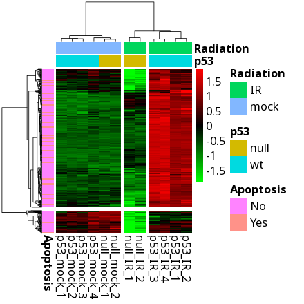

## Visualizing High-Dimensional Data in Your Browser

To use the app, just visit a [static page on GitHub](https://gexijin.github.io/datamap/)

DataMap is a secure, browser-based application for visualizing high-dimensional 'omics and other data matrices with heatmaps, PCA, and t-SNE. Built with Shiny and running entirely in your browser through Shinylive technology, DataMap ensures your data never leaves your device.

## Features

- **Browser-based**: No installation required, runs completely in your browser
- **Secure**: Your data stays on your device, never uploaded to any server
- **Interactive Visualizations**: 
  - Heatmaps with hierarchical clustering
  - Principal Component Analysis (PCA)
  - t-SNE (t-Distributed Stochastic Neighbor Embedding)
- **Data Transformations**: 
  - Log transformation
  - Scaling and normalization
  - Missing value handling
  - Outlier capping
- **Exportable**: Generate reproducible R code for your analysis
- **Multiple File Formats**: Supports CSV, TSV, TXT, and Excel files
- **Customizable**: Extensive visualization parameters

### Data Format Requirements

Your data should be organized in a matrix format where:
- The first row must contain column headers
- The first column may contain row identifiers.
- Some columns can be categorical, which will be used to color rows.
- Column annotation can be uploaded separately.

## FAQ

**Is my data secure?**  
Yes. DataMap runs entirely in your browser. Your data never leaves your device.

**What browsers are supported?**  
Chrome, Firefox, Edge, and Safari (latest versions recommended).

**Can I use DataMap offline?**  
Yes, once loaded in your browser, DataMap can operate without an internet connection.

## How to Cite

If you use DataMap in your research, please cite it as:

> Ge, X. (2025). DataMap: A secure browser-based application for visualizing high-dimensional data matrices. [Software]. Available from: https://gexijin.github.io/datamap/

**Dr. Xijin Ge** is a Professor at South Dakota State University specializing in bioinformatics and data science.

- [University Profile](https://www.sdstate.edu/directory/xijin-ge)
- [LinkedIn](https://www.linkedin.com/in/steven-ge-ab016947/)
- [BlueSky](https://bsky.app/profile/stevenge.bsky.social)

